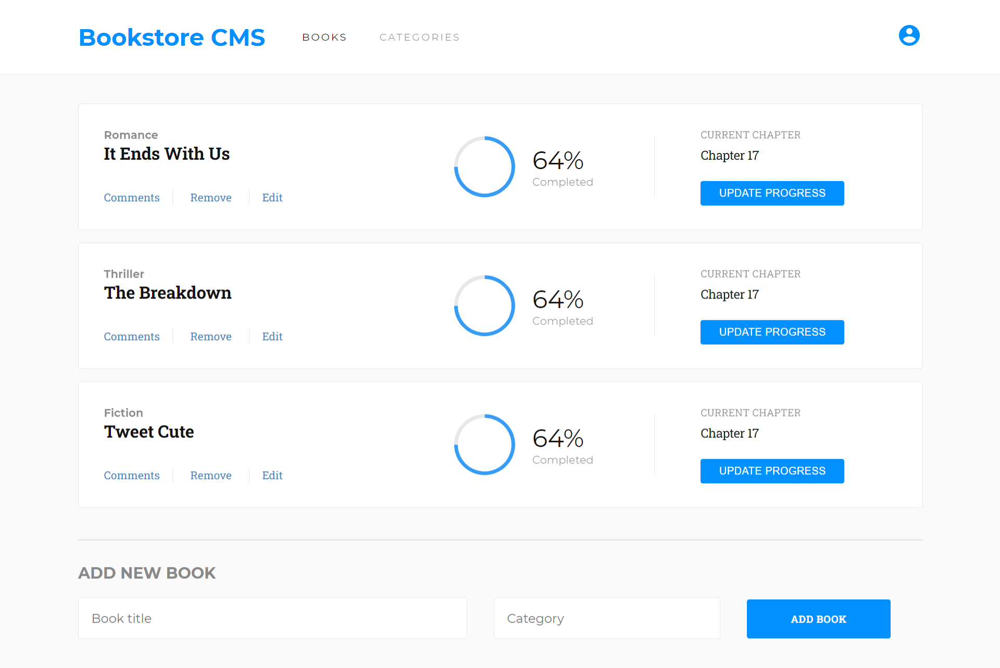

# Bookstore-React-Redux
> A basic website that allows you to display a list of books, add a book and remove a selected book, using the Bookstore API.

## Built With

- ReactJS
- Redux

## Live demo

[Bookstore](https://zeenatlawal.github.io/Bookstore-React-Redux/)

## Getting Started

### To get a local copy run the following steps:

- Copy this link `https://github.com/ZeenatLawal/Bookstore-React-Redux.git`
- Open your terminal or command line
- Run `git clone` and paste the link
- Open the folder with your code editor
- Create a branch to work on
- Run `npm install`
- Run `npm start` to launch the server.

## Author

👤 **Zeenat Lawal**

- GitHub: [@ZeenatLawal](https://github.com/ZeenatLawal)
- Twitter: [@lawal_zeenat](https://twitter.com/lawal_zeenat)
- LinkedIn: [Zeenat Lawal](https://www.linkedin.com/in/zeenatlawal/)

## 🤝 Contributing

Contributions, issues, and feature requests are welcome!

Feel free to check the [issues page](https://github.com/ZeenatLawal/Bookstore-React-Redux/issues).

## Show your support

Give a ⭐️ if you like this project!

## Acknowledgments

- Learning partners, Standup and morning session team
